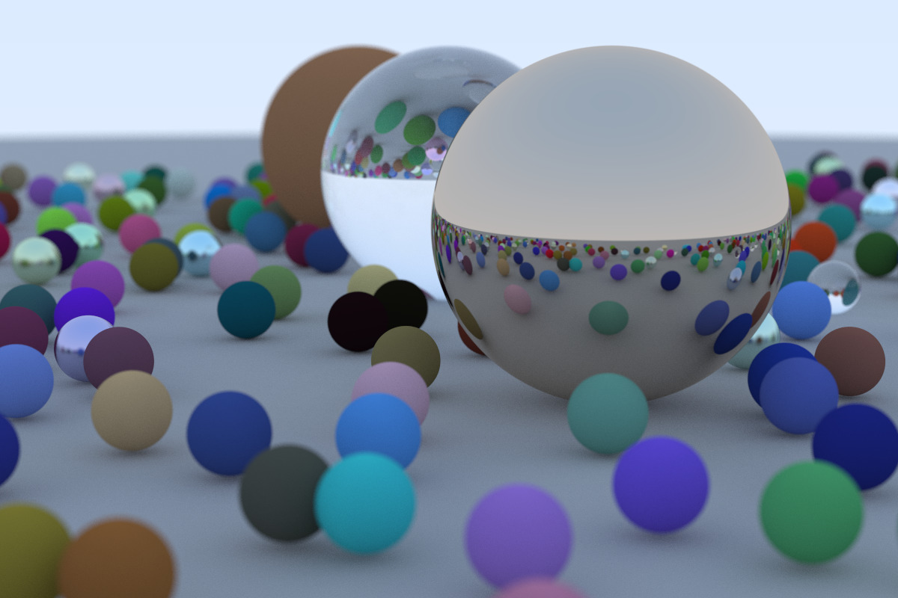
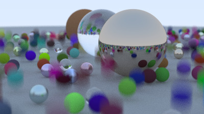

# Ray Tracing in One Weekend in Zig

Usage:
```
zig build run -Drelease-fast > image.ppm
```

Final image at the end of book 1:  


Book 2, chapter 1: Moving spheres  


https://raytracing.github.io/books/RayTracingInOneWeekend.html


